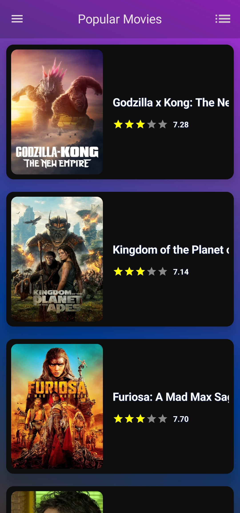
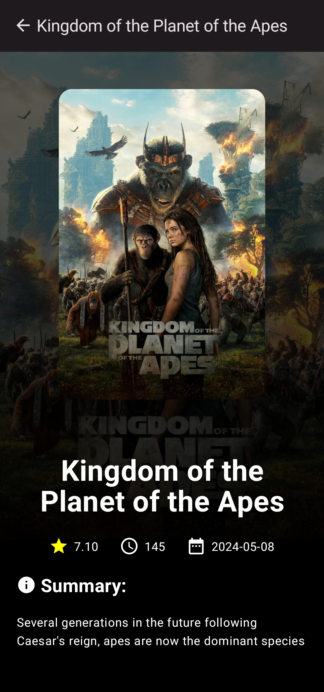

# YaMovies

YaMovies is an Android application that provides users with information about movies. Users can browse popular movies, view details about each movie.

## Features

- Browse popular movies
- View movie details including synopsis, rating, and release date
- User-friendly interface

## Screenshots

Here are some screenshots of the YaMovies app:

### Home Screen
<div style="display: flex;">
  
  
</div>

### Movie Details



## Installation

To set up YaMovies on your local machine, follow these steps:

1. **Clone the repository:**
    ```bash
    git clone https://github.com/ilyes-bds/YaMovies
    cd YaMovies
    ```
    
2. **Open the project in Android Studio:**
    - Open Android Studio.
    - Select `File > Open` and navigate to the `YaMovies` directory.

3. **Get Your API Key:**
    - Sign up for an API key from the movie database service you are using ([TMDb](https://www.themoviedb.org/)).

4. **Configure the API Key:**
    - Locate the `API_KEY` where is defined in the `Util.kt` file.
    - Replace the placeholder value with your actual API key:
      ```const val API_KEY = "YOUR_API_KEY_HERE"```

4. **Build and run the project:**
    
    - Make sure you have an Android device or emulator set up.
    - Click the `Run` button in Android Studio.

## Usage

Once the app is installed and running:

1. Open the YaMovies app on your Android device.
2. Browse through the list of popular movies.
3. Tap on a movie to see more details.

## Contact

If you have any questions, feel free to reach out:

- Boudissa Lyes - [ilyes.boudissa.123@gmail.com](mailto:ilyes.boudissa.123@gmail.com)
- GitHub: [ilyes-bds](https://github.com/ilyes-bds)
